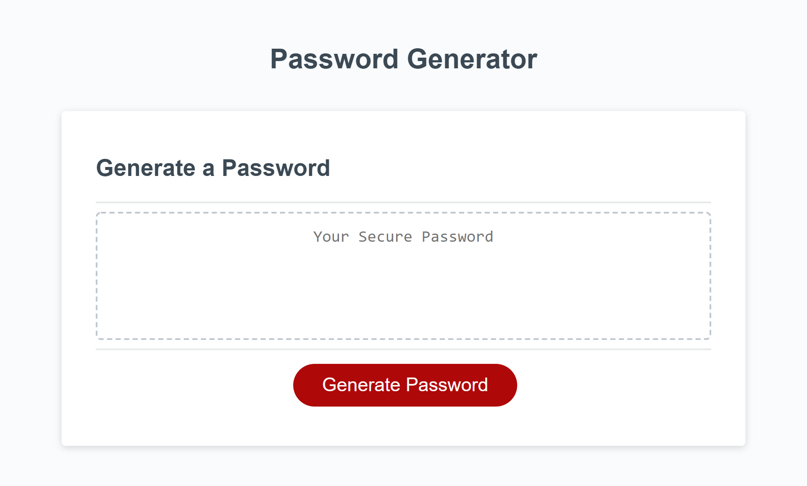
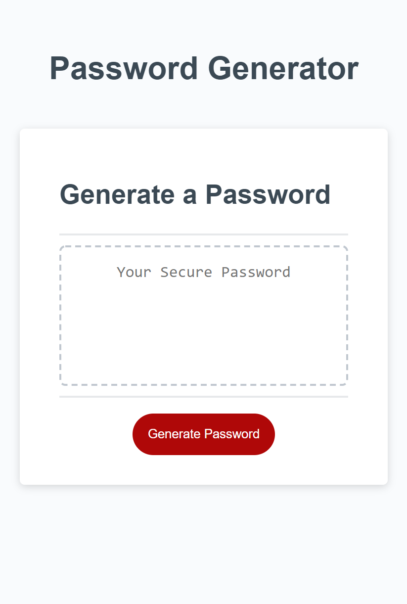

# Password Generator

## Overview

Using JavaScript, this generator creates a randomized password and displays it in the box. 

## Functionality

- When the user clicks the 'Generate' button, they will be prompted to choose the desired length of their password

- If the password is shorter than 8 characters, or longer than 128 characters, the user will be prompted to choose the apropriate length

- Once the user chooses their desired length, they will be asked to confirm whether they would like to include any of the following:
    - Lowercase Characters
    - Uppercase Characters
    - Numbers
    - Special Characters ('$', '&', '!', etc.)

- If the user fails to choose any of the options, they will get an alert that they must choose at least one parameter and will have to click the 'Generate' button to start again

- If they choose at least one of the parameters, a randomized password will be generated and displayed in the text box

## Layout

Desktop Layout:

Mobile Layout:

## Link to Deployed Page

https://jl118.github.io/password-generator/